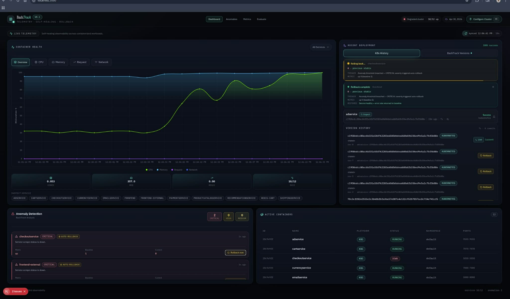
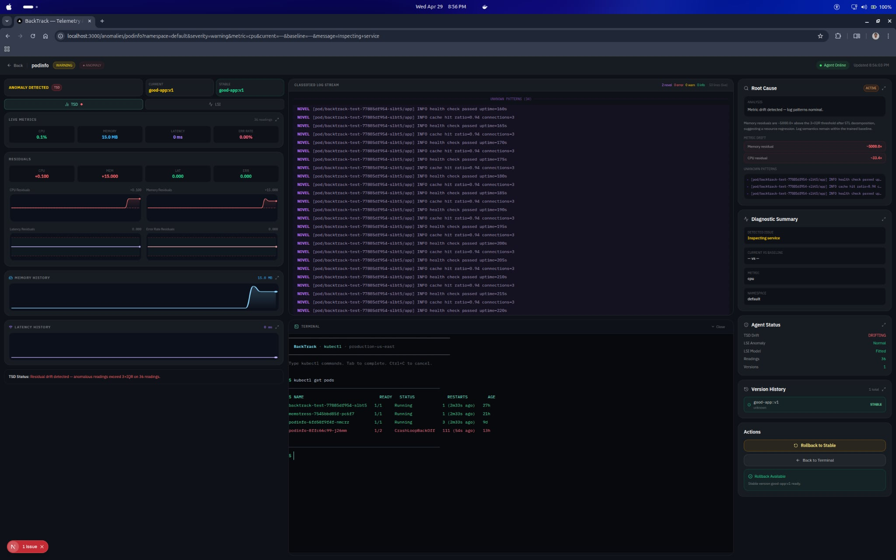
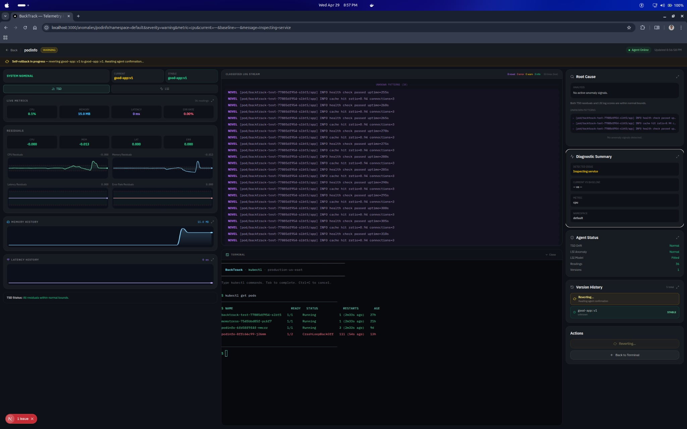

# BackTrack

> **Local-first observability, anomaly detection, and autonomous self-healing rollback for Kubernetes and Docker workloads.**

BackTrack monitors containerized services in real time, detects metric drift and log anomalies using two independent ML algorithms — **TSD** (Time Series Decomposition) and **LSI** (Latent Semantic Indexing) — and automatically rolls back to the last stable version when thresholds are breached. No cloud dependency. No SaaS. No agent phone-home.


---

## Table of Contents

- [What It Does](#what-it-does)
- [Screenshots](#screenshots)
- [Architecture](#architecture)
- [Quick Start — Docker Hub](#quick-start--docker-hub)
- [Quick Start — From Source](#quick-start--from-source)
- [Kubernetes Mode](#kubernetes-mode)
- [Docker Mode](#docker-mode)
- [Configuration Reference](#configuration-reference)
- [How TSD Works](#how-tsd-works)
- [How LSI Works](#how-lsi-works)
- [Rollback Flow](#rollback-flow)
- [Pages](#pages)
- [API Reference](#api-reference)
- [Troubleshooting](#troubleshooting)
- [Security Notes](#security-notes)

---

## What It Does

| Capability | Description |
|---|---|
| **Service Discovery** | Auto-discovers pods/containers via `kubectl get deployments` or `docker ps` |
| **Per-Service Monitoring** | Independent TSD + LSI collectors per service |
| **Live Metrics** | Polls Prometheus for CPU, memory, request rate — falls back to `kubectl top` or `docker stats` |
| **TSD** | STL decomposition → flags drift when residuals exceed 3×IQR for 3 consecutive readings |
| **LSI** | TF-IDF + SVD on live logs → classifies INFO / WARN / ERROR / NOVEL per 30-second window |
| **Crash Detection** | Monitors container restart count and exit codes — triggers immediate rollback on crash |
| **Memory Leak Detection** | Flags monotonic memory growth (>15% over 6 consecutive readings) |
| **Auto-Rollback** | After 3 consecutive anomaly cycles (~90 s), rolls back to last STABLE snapshot |
| **Crash Rollback** | Container crash triggers rollback immediately — no 3-cycle wait |
| **Replica Restore** | *(Kubernetes)* Restores replicas automatically if deployment was scaled to 0 |
| **Confusion Matrix** | Live precision, recall, F1, and accuracy for both TSD and LSI |
| **MTTR Tracking** | Measures detection-to-recovery time across all rollback events |
| **Rollback History** | Full audit trail with timestamps, exit codes, and service context |
| **Kubectl Terminal** | Interactive terminal embedded in the Anomalies page |

---

## Screenshots

### Dashboard — Live Telemetry

*Container Health chart, Recent Deployments, Anomaly Detection, Active Containers table.*

### Anomalies — TSD + LSI Live Panels

*Anomalies page with agent online — interactive terminal, TSD Metrics, LSI Analysis.*

### Anomalies — Full Live View

*TSD metrics update every 10 s. LSI score history fills as the corpus grows.*

### Service Diagnostics — Per-Service Drill-Down

*TSD/LSI panels, classified log stream, root cause analysis, rollback action.*

---

## Architecture

```
┌──────────────────────────────────────────────────────────────┐
│                     BackTrack Dashboard                       │
│               Next.js 16 · React 19 · TypeScript             │
│                                                               │
│  /                  → Dashboard (health, metrics, anomalies)  │
│  /anomalies         → Terminal + per-service TSD/LSI panels   │
│  /anomalies/[svc]   → Service diagnostics + rollback action   │
│  /metrics           → MTTR + Confusion Matrix                 │
│  /evaluate          → ISO 25010 evaluation form               │
└──────────────────┬──────────────────────┬────────────────────┘
                   │                      │
             kubectl / docker        HTTP :8847
                   │                      │
       ┌───────────▼──────┐   ┌───────────▼──────────────────┐
       │   Your Cluster   │   │       backtrack-agent         │
       │   or Docker      │   │       Python · FastAPI        │
       │   runtime        │   │                               │
       └──────────────────┘   │  TSD collector  (per service) │
                              │  LSI log analyser (per service)│
                              │  Crash / restart monitor      │
                              │  Version snapshotter          │
                              │  Rollback executor            │
                              └───────────────────────────────┘
```

**Ports:**

| Service | Port |
|---|---|
| backtrack-dashboard | `3847` |
| backtrack-agent | `8847` |

---

## Quick Start — Docker Hub

No Node.js, no Python. Requires Docker only.

**Step 1 — Download the compose file**

> **Windows note:** Use **Command Prompt** or **Git Bash** for this command. In PowerShell, `curl` is an alias for `Invoke-WebRequest`, which may behave differently with `-O`.

```bash
mkdir backtrack && cd backtrack
curl -O https://raw.githubusercontent.com/KenMarzan/BackTrack/main/docker-compose.hub.yml
```

**Step 2 — Start BackTrack**

```bash
docker compose -f docker-compose.hub.yml up -d
```

If the dashboard does not open on http://localhost:3847 and you see an error or message referring to port `3000`, this usually means one of the following:

- You're running the local Next.js development server (which defaults to `3000`) instead of the production container image.
- The container started with a different `PORT` environment variable (or a stale image) and is listening on a different port.

Quick checks and fixes:

- Verify the dashboard container is running and bound to port 3847:

```bash
docker compose -f docker-compose.hub.yml ps
docker compose -f docker-compose.hub.yml logs backtrack-dashboard --tail 100
```

- Confirm the image's `PORT` in the built image (the official image sets `PORT=3847`):

```bash
docker compose -f docker-compose.hub.yml exec backtrack-dashboard sh -c 'echo $PORT || cat /app/.env || ps aux'
```

- If you are running the app from source (not the image), the Next.js dev server defaults to `3000`. Run the dev server on `3847` explicitly:

```bash
PORT=3847 npm run dev
```

- To force a fresh production container using the Docker Hub image:

```bash
docker compose -f docker-compose.hub.yml down
docker compose -f docker-compose.hub.yml pull
docker compose -f docker-compose.hub.yml up -d --force-recreate --build
```

Do not set `PORT=3000` for the production image — that port is commonly used by other apps and is not required for BackTrack. The supported production port is `3847` (the image sets `PORT=3847`).

**Step 3 — Connect your app**

1. Open **http://localhost:3847**
2. Click **Configure Cluster** (top-right)
3. Choose **Docker** or **Kubernetes**
4. Enter your container or deployment name → click **Connect**

BackTrack will discover your services and begin building the anomaly baseline automatically. A progress bar on the Anomalies page shows warmup status (~2 minutes).
> **Kubernetes users:** Mount your kubeconfig before starting. See [Kubernetes Mode](#kubernetes-mode).

---

## Quick Start — From Source

**Prerequisites:** Node.js 20+, Python 3.10+, Docker CLI or `kubectl`

**Step 1 — Clone the repository**

```bash
git clone https://github.com/KenMarzan/BackTrack.git
cd BackTrack
```

**Step 2 — Start the dashboard**

```bash
cd backtrack-dashboard
npm install
npm run dev
```

Dashboard available at **http://localhost:3847**.

> For production: `npm run build && npm run start`

**Step 3 — Start the agent**

```bash
cd backtrack-agent
python3 -m venv .venv
.venv/bin/pip install -r requirements.txt
```

Docker mode:

```bash
BACKTRACK_MODE=docker \
BACKTRACK_TARGET=<container-name> \
BACKTRACK_IMAGE_TAG=<current-tag> \
.venv/bin/uvicorn src.main:app --host 0.0.0.0 --port 8847
```

Kubernetes mode:

```bash
BACKTRACK_MODE=kubernetes \
BACKTRACK_K8S_NAMESPACE=<namespace> \
BACKTRACK_TARGET=<deployment-name> \
BACKTRACK_IMAGE_TAG=<current-tag> \
.venv/bin/uvicorn src.main:app --host 0.0.0.0 --port 8847
```

**Step 4 — Connect**

Open **http://localhost:3847** → click **Configure Cluster** → fill in the form → **Connect**.

---

## Kubernetes Mode

BackTrack uses `kubectl` from inside the container. Mount your kubeconfig into both services.

**Using Docker Hub (`docker-compose.hub.yml`):** Uncomment the kubeconfig volume under both services:

```yaml
volumes:
  - ${KUBE_DIR:-~/.kube}:/root/.kube:ro   # ← uncomment this line
```

Then set the mode:

```bash
BACKTRACK_MODE=kubernetes
BACKTRACK_K8S_NAMESPACE=default   # your target namespace
```

Restart:

```bash
docker compose -f docker-compose.hub.yml down
docker compose -f docker-compose.hub.yml up -d
```

In the Connect modal:
- **Platform** → Kubernetes
- **Architecture** → Microservices (discovers all deployments in the namespace)
- **Namespace** → your namespace

**Verify pod labels**

BackTrack uses `app=<service-name>` as the label selector by default:

```bash
kubectl get pods -n default --show-labels | head -5
# Pods should have: app=frontend, app=checkoutservice, etc.
```

To override: set `BACKTRACK_K8S_LABEL_SELECTOR=<selector>` in your environment.

---

## Docker Mode

No cluster configuration needed — only the container name.

1. Open **http://localhost:3847**
2. Click **Configure Cluster**
3. **Platform** → Docker
4. **Application name** → exact container name

```bash
docker ps --format "{{.Names}}"   # find your container name
```

5. Click **Connect**

The Docker socket is already mounted — no additional setup required.

---

## Configuration Reference

### Agent Environment Variables

Set these as environment variables or in a `.env` file alongside `docker-compose.hub.yml`.

```env
# ── Required ───────────────────────────────────────────────
BACKTRACK_TARGET=my-app          # Container name (Docker) or deployment name (K8s)
BACKTRACK_IMAGE_TAG=latest       # Current image tag for snapshot tracking

# ── Mode ───────────────────────────────────────────────────
BACKTRACK_MODE=                  # docker | kubernetes  (auto-detected if blank)
BACKTRACK_K8S_NAMESPACE=default  # Kubernetes namespace to watch
BACKTRACK_K8S_LABEL_SELECTOR=    # Override pod label selector (e.g. app=myapp)

# ── Rollback ───────────────────────────────────────────────
BACKTRACK_ROLLBACK_ENABLED=true  # Set to false to disable auto-rollback
BACKTRACK_ROLLBACK_COOLDOWN=120  # Seconds between consecutive rollbacks
BACKTRACK_STABLE_SECONDS=120     # Clean seconds before marking a version STABLE

# ── Scraping ───────────────────────────────────────────────
BACKTRACK_SCRAPE_INTERVAL=10     # Seconds between metric scrapes

# ── TSD Sensitivity ────────────────────────────────────────
BACKTRACK_TSD_IQR_MULTIPLIER=3.0 # Lower = more sensitive to drift

# ── LSI Sensitivity ────────────────────────────────────────
BACKTRACK_LSI_SCORE_MULTIPLIER=2.0
BACKTRACK_SVD_SIMILARITY_THRESHOLD=0.55  # Raise to reduce false positives
BACKTRACK_CORPUS_SIZE=200        # Log lines required before fitting the LSI model
BACKTRACK_BASELINE_WINDOWS=10    # Scoring windows before locking the LSI baseline
BACKTRACK_WINDOW_SECONDS=30      # LSI scoring window duration in seconds

# ── Storage ────────────────────────────────────────────────
BACKTRACK_DATA_DIR=/data         # Data directory inside the agent container
```

### Dashboard Environment Variables

Create `backtrack-dashboard/.env.local` when running from source:

```env
BACKTRACK_AGENT_URL=http://127.0.0.1:8847   # URL of the running backtrack-agent
GITHUB_TOKEN=                                # Optional — GitHub PAT for deployment panel
BACKTRACK_MEMORY_THRESHOLD_MIB=120          # Memory anomaly threshold in MiB
```

---

## How TSD Works

BackTrack collects CPU, memory, latency, and error rate every 10 seconds. Once 12 readings are available, it runs STL decomposition on each metric series:

1. **STL decomposition** — splits each series into Seasonal + Trend + Residual components
2. **IQR envelope** — computes 3×IQR on historical residuals as the normal drift boundary
3. **Drift detection** — raised when the last 3 consecutive residuals all exceed 3×IQR
4. **Spike detection** — raw history compared against a first-half baseline using a 5×spread threshold; catches step changes that STL absorbs into the trend
5. **Memory leak detection** — flags monotonic growth exceeding 15% over 6 consecutive readings
6. **Crash detection** — monitors container restart count and exit codes; triggers immediate rollback on non-zero exit
7. **Flat-zero detection** — catches crashes where metrics drop to near-zero from a non-zero baseline

**Warmup timeline:**

| Milestone | Time after agent start |
|---|---|
| Metric collection begins | Immediately |
| TSD drift detection active | ~2 min (12 readings × 10 s) |
| Version marked STABLE | 2 min clean operation (configurable) |
| Auto-rollback triggers | 3 anomaly cycles (~90 s after drift begins) |
| Crash rollback triggers | Immediately on next scrape (~10 s) |

---

## How LSI Works

BackTrack tails logs from each container or pod and processes them in 30-second windows:

1. **Corpus collection** — first 200 log lines build the training set (snapshot of historical logs, then live tail)
2. **TF-IDF vectorisation** — each log line is vectorised
3. **SVD reduction** — latent semantic space built with centroids per class (INFO / WARN / ERROR)
4. **Structured level extraction** — lines with explicit log levels (e.g. `ERROR`, `WARN`) are fast-pathed before SVD scoring
5. **SVD classification** — cosine similarity against class centroids; lines below the threshold (default 0.55) are classified NOVEL
6. **Anomaly score** — `(ERROR×3 + NOVEL×5 + WARN×1) / total` per 30-second window
7. **Rolling baseline** — baseline updates from non-anomalous windows only, adapting to normal log evolution without being corrupted by real anomalies

**Warmup timeline:**

| Milestone | Time after agent start |
|---|---|
| Log tailing starts | Immediately |
| Corpus filled (200 lines) | ~2–3 min for active services |
| Baseline locked | ~5 min after corpus fill |
| Anomaly detection active | After baseline locked |

---

## Rollback Flow

### Automatic (agent-triggered)

1. Agent detects 3 consecutive anomaly cycles (TSD drifting **or** LSI anomalous)
2. Executes rollback to last STABLE snapshot
3. Enforces a 120-second cooldown to prevent rollback loops
4. Records MTTR as: `first anomaly detection → rollback completion`

### Crash Rollback (immediate)

1. Agent detects container exit with non-zero exit code, or restart count increases
2. Triggers rollback immediately — no 3-cycle wait
3. Records exit code in rollback history

### Manual (dashboard-triggered)

1. Dashboard → Recent Deployments → **Rollback** button
2. Calls `POST /api/rollback` → agent executes rollback

### Docker Rollback Behaviour

Preserves original container configuration (ports, environment variables, volume mounts, network mode) from `docker inspect` before stopping and recreating the container with the stable image tag.

### Kubernetes Rollback Behaviour

Executes `kubectl rollout undo deployment/<name>`. If replicas were scaled to 0, automatically scales to 1 before the undo.

---

## Pages

| Page | Route | Description |
|---|---|---|
| **Dashboard** | `/` | Container health charts, deployment history, anomaly list, active containers |
| **Anomalies** | `/anomalies` | Interactive kubectl terminal, per-service TSD + LSI live panels |
| **Service Diagnostics** | `/anomalies/[service]` | TSD/LSI panels, classified log stream, root cause analysis, rollback action |
| **Evaluation Metrics** | `/metrics` | MTTR history, TSD + LSI confusion matrix (precision / recall / F1 / accuracy) |
| **ISO 25010 Evaluation** | `/evaluate` | Structured quality evaluation form for respondents |

---

## API Reference

### Dashboard Routes

| Method | Path | Description |
|---|---|---|
| `GET` | `/api/connections` | List all saved connections |
| `POST` | `/api/connections` | Test or create a connection |
| `GET` | `/api/dashboard/overview` | Aggregated service health and anomaly list |
| `GET` | `/api/deployments/history` | Rollout history from kubectl |
| `POST` | `/api/rollback` | Trigger rollback for a service |
| `GET` | `/api/agent?path=<endpoint>` | Proxy to backtrack-agent |
| `GET` | `/api/prometheus/query` | Proxy PromQL query with Bearer auth |
| `POST` | `/api/terminal` | Execute a shell command |
| `GET` | `/api/metrics/mttr` | MTTR stats and rollback history |
| `GET` | `/api/metrics/detection` | Confusion matrix and detection entries |

### Agent Endpoints (port 8847)

| Method | Path | Description |
|---|---|---|
| `GET` | `/health` | Agent status, uptime, monitored services |
| `GET` | `/services` | Per-service drift, anomaly, crash flags, restart count |
| `GET` | `/metrics?service=<name>` | TSD metrics, decomposition, evaluation |
| `GET` | `/lsi?service=<name>` | LSI scores, classified logs, confusion matrix |
| `GET` | `/versions` | Version snapshots (PENDING / STABLE / ROLLED_BACK) |
| `GET` | `/rollback/history` | Full rollback event log |
| `POST` | `/rollback/trigger` | Manually trigger rollback for a service |
| `POST` | `/reconfigure` | Hot-reload target and services without agent restart |

---

## Troubleshooting

**Dashboard shows no services**
```bash
kubectl get pods -n default    # verify pods are running
docker ps                      # verify containers are up
```

**Agent not reachable**
```bash
curl http://127.0.0.1:8847/health    # should return {"status":"ok"}
curl http://127.0.0.1:8847/services  # list monitored services
```

**All metrics are zero**
- Kubernetes: verify metrics-server is installed — `kubectl top pods -n default`
- Docker: verify the Docker socket is mounted — `/var/run/docker.sock:/var/run/docker.sock`
- Check for port conflicts: `ss -tlnp | grep 8847`

**TSD or LSI panels empty after connecting**
- TSD requires ~2 min to warm up (12 readings)
- LSI requires ~5 min to warm up (200 log lines + baseline locking)
- Progress bars are shown on the Anomalies page during warmup
- The service name in Connect must exactly match the deployment or container name

**Rollback did not restore the app**
- Check rollback history: `curl http://127.0.0.1:8847/rollback/history`
- Kubernetes: BackTrack auto-scales replicas to 1 if scaled to 0 before running rollout undo
- Docker: verify the agent has write access to the Docker socket

**Kubernetes — kubectl finds no pods**
- Ensure kubeconfig is mounted (see [Kubernetes Mode](#kubernetes-mode))
- Verify pods have `app=<name>` labels: `kubectl get pods --show-labels`

**LSI corpus stuck at 0 lines**
```bash
kubectl logs -n default -l app=<service> --tail=5   # verify logs exist
curl http://127.0.0.1:8847/services                 # check agent sees the service
```

**High LSI false positives**
```env
BACKTRACK_SVD_SIMILARITY_THRESHOLD=0.70   # raise from default 0.55
BACKTRACK_LSI_SCORE_MULTIPLIER=3.0        # raise from default 2.0
```

**Too many TSD alerts**
```env
BACKTRACK_TSD_IQR_MULTIPLIER=5.0   # raise from default 3.0
```

**Container name not matching**

BackTrack resolves names through a fallback chain:
1. Exact Docker Compose project name match
2. Container name or image name contains the input string
3. Partial project name match

If nothing matches, the Connect modal shows available container names as suggestions.

---

## Security Notes

BackTrack is designed for **local or internal operator use only**.

- `POST /api/terminal` executes arbitrary shell commands — **do not expose this port publicly**
- Connection tokens are stored in `.backtrack/connections.json` as plain text
- No authentication or RBAC is provided by default
- The Docker socket mount grants full Docker daemon access to the containers

---

## License

MIT — see [LICENSE](LICENSE).
